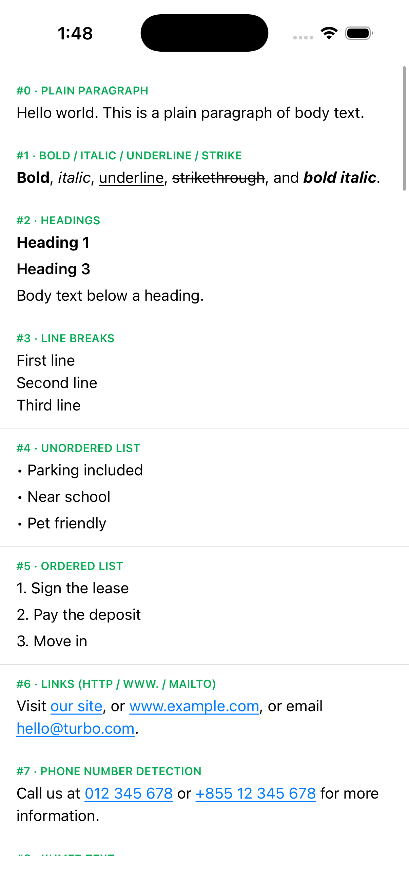

# react-native-turbo-html

Native HTML-paragraph text for React Native's New Architecture (Fabric). It renders a
constrained subset of HTML — the kind you get back from a CMS or API field — as real native
text and **sizes itself**: a custom C++ `ShadowNode` implements `measureContent`, so Yoga asks
the native text engine for the exact height during layout. No JS measuring, no height passed
as a style, no post-mount resize/jump.

- **iOS:** parses with a byte-level HTML scanner and lays out with Core Text (`CTTypesetter`),
  written in Objective-C++ (no Swift), cached per (html, style) and per (width, numberOfLines).
- **Android:** the same rules, implemented in Kotlin with `StaticLayout` and a JNI measure
  bridge (`FabricUIManager.measure`), matching the pattern used by RN's own `AndroidSwitch`/
  `AndroidProgressBar`.
- **Web:** no Core Text / StaticLayout engine to size itself against, so this is a minimal
  fallback that strips the HTML to plain text and renders it in a `<Text>` (see
  [Colors](#colors-todo-configurable) below and `src/stripHtml.ts`).

iOS and Android get the real native engine; web is a plain-text fallback only.



## Why not just measure in JS?

| Option | Sizes itself? | Verdict |
| --- | --- | --- |
| Turbo/Expo module + `setViewSize` after mount | No — a state update after mount makes the row jump | Rejected |
| Nitro `HybridView` | No — nitrogen's generated `ShadowNode` has no `measureContent`, so height still comes from JS | Rejected |
| **Fabric component + custom C++ `ShadowNode`** | **Yes — Yoga calls `measureContent` with the real available width during layout** | **This package** (same approach as RN's own `<Text>`) |

## Rendering rules

The parser/document builder implements the same rules on both platforms, so switching a call
site from a JS HTML renderer is meant to be visually neutral:

- Top-level blocks are separated by a small gap (4pt/4dp). Blocks nested inside an unknown
  wrapper tag (e.g. `<div>`) are not separated from each other.
- `p`/`li`/`h1`–`h6` render their whole subtree inline. Headings keep the caller's font size
  (so a caller's own text size class can still win) and only change weight — for Khmer,
  heading weight maps to semibold instead of bold.
- `ul`/`ol`: only direct `li` children become rows, each with a "•"/"N." marker in its own
  column and a hanging indent for wrapped lines.
- Bare text at block level becomes its own unstyled block, without phone-number detection.
- `<br>` and raw newlines in the source are hard line breaks, with browser semantics: a
  trailing `<br>` doesn't open an extra line (`<p>a<br></p>` is one line, `<p><br></p>` one
  empty line).
- Empty blocks (only whitespace, `<br>` or `&nbsp;`) at the very start or end are dropped —
  editors pad API content with them. Empty blocks in the middle are kept as spacing.
- `head`/`script`/`style`/`meta`/`link` are dropped along with their contents.
- **Deliberate additions:** `a[href]` (http/https/mailto/tel schemes only, and `www.` gets
  `https://` prepended) becomes a tappable link; `s`/`del` render as strikethrough. Phone
  number detection is tightened: 8–15 digits, no line-spanning whitespace, and date-shaped
  strings (`2024-01-15`, `15-01-2024`) are rejected.

## Install

```sh
yarn add react-native-turbo-html
# or
npm install react-native-turbo-html
```

iOS: run `pod install` in your `ios/` directory. Android: autolinking picks up the module
(and its hand-written `ComponentDescriptor`/JNI measure bridge) automatically via
`react-native.config.js`. No further linking steps — this is a New Architecture (Fabric)
component, so the New Architecture must be enabled in your app.

## Usage

```tsx
import { TurboHtmlView } from "react-native-turbo-html";

<TurboHtmlView
  html="<p>Hello <b>world</b>. Call <a href=\"tel:+855123456789\">us</a>.</p>"
  fontFamily="Inter" // any font your app ships; omit for the system font
  fontSize={14}
  lineHeight={20}
  numberOfLines={0}
  detectPhoneNumbers
  onLinkPress={(e) => console.log(e.nativeEvent.url, e.nativeEvent.type)}
/>;
```

## Props

| Prop | Type | Description |
| --- | --- | --- |
| `html` | `string` | The HTML string to render. |
| `fontFamily` | `string` (default: system font) | Any font your app ships, resolved like RN `<Text fontFamily>`: a family name (`"Inter"`, `"Kantumruy Pro"`) or a PostScript name (`"Figtree-Regular"`). Bold/semibold/italic pick the closest face of that family; missing italics are synthesized. On Android, anything `ReactFontManager` knows (expo-font families, `assets/fonts`, system families). |
| `fontSize` | `number` (default `14`) | Base font size (points/dp). Headings keep this size and only change weight. |
| `lineHeight` | `number` (default `0` = natural, ≈ 1.2 × `fontSize`) | Line box height; glyphs are vertically centered in it, the same way RN `<Text lineHeight>` distributes extra leading. |
| `headingFontWeight` | `number` (default `700`) | Weight for `<h1>`/`<h2>`; `<h3>`/`<h4>` use `min(headingFontWeight, 600)`. Useful when a script's bold face is too heavy (e.g. `600` for Khmer). |
| `numberOfLines` | `number` (default `0`) | `0` means unlimited. A positive value truncates with a trailing "…" and reports `truncated`-style clipping the same way on both platforms. |
| `detectPhoneNumbers` | `boolean` (default `true`) | Turns matched phone-number-shaped runs into `tel:` links. |
| `onLinkPress` | `(event) => void` | Fires with `{ url, type }`, where `type` is `"link"` for `<a href>` or `"phone"` for a detected number. |

Both `fontSize` and `lineHeight` are scaled by the system's Dynamic Type / font-scale
multiplier (`allowFontScaling` semantics), matching RN `<Text>`.

### Colors

| Prop | Type | Default |
| --- | --- | --- |
| `color` | `ColorValue` | iOS `UIColor.labelColor`, Android theme `textColorPrimary` |
| `linkColor` | `ColorValue` | iOS `UIColor.linkColor`, Android theme `textColorLink` |

Colors are applied at draw time and are never part of the layout cache, so changing them
(or switching light/dark) only redraws. `PlatformColor` and `DynamicColorIOS` work — e.g.
`color={DynamicColorIOS({ light: "#7d7d7d", dark: "#898989" })}` follows the system theme
on iOS without a re-render.

## Architecture

An animated walkthrough of the pipeline (render → shadow tree → Yoga `measureContent` → commit → mount → draw, with a toggle showing the row jump without a measuring ShadowNode) is in [`docs/shadow-node-pipeline.html`](docs/shadow-node-pipeline.html) — open it in a browser.

```
JS (render only)                 Yoga layout (JS/bg thread)              Main thread
────────────────                 ──────────────────────────              ───────────
<TurboHtmlView                   TurboHtmlViewShadowNode                 TurboHtmlView (iOS, RCTViewComponentView) /
  html fontFamily                  ::measureContent(ctx, constraints)      TurboHtmlView (Android)
  fontSize lineHeight                ├ iOS: TurboHtmlMeasure(...)           updateProps → draw from the same
  numberOfLines />                  │   (Objective-C++, extern "C")        cached layout (cache hit — no
                                     └ Android: TurboHtmlMeasurementsManager re-parsing, no re-layout)
                                         (JNI → FabricUIManager.measure)
```

- **C++ ShadowNode** (`cpp/react/renderer/components/TurboHtmlViewSpec/`): a
  `LeafYogaNode`/`MeasurableYogaNode` whose `measureContent` calls straight into the native
  text engine (iOS) or through a JNI bridge into the Kotlin `ViewManager.measure` (Android).
  Hand-written, not codegen — `codegenConfig.type` generates only `Props`/`EventEmitters`.
- **iOS engine** (`ios/Core/*.mm`, Objective-C++, Foundation + CoreText + CoreGraphics only —
  compiles standalone on macOS for `tests/`): `HTMLScanner` (byte-level UTF-8 scanner) →
  `RichTextDocumentBuilder` (block/inline model, batched `CFAttributedString` runs) →
  `RichTextLayouter` (manual `CTTypesetter` line placement, link/decoration rect geometry) →
  `RichTextEngine` (`NSCache`-backed parse+layout cache, quarter-point width buckets). The
  view (`ios/TurboHtmlCanvas.mm`, UIKit) only draws the cached layout; `ios/TurboHtmlView.mm`
  is the Fabric `RCTViewComponentView` host.
- **Android engine** (`android/src/main/java/com/turbohtml/core/*.kt`): the same rules with
  `StaticLayout` instead of Core Text, an `LruCache`-backed engine, and a `ComponentDescriptor`
  (`android/src/main/jni/`) that attaches a `TurboHtmlMeasurementsManager` in `adopt()`.

The parse + layout result is cached per (html, style) and per (width, numberOfLines), so the
common case — a row scrolling back into view at the same width — draws with no parsing or
line-breaking work at all. On iOS, a cache *hit* on the measure path never touches Foundation
string storage: `TurboHtmlMeasure` hands the ShadowNode's raw UTF-8 bytes straight to the
engine, which hashes and compares those bytes directly (no `NSString`/UTF-16 round trip).

## Tests

`tests/run.sh` compiles the platform-independent core (`ios/Core/*.mm`) together with
`tests/main.mm` and runs the resulting binary on macOS (same Core Text engine used on iOS),
registering the bundled test fonts in `tests/fonts/`:

```sh
./tests/run.sh
```

It exercises the HTML scanner, document builder, phone-number detection, Core Text layout,
truncation, and a battery of malformed/large-input robustness cases (57 checks), plus a
timing report for the scanner, document builder, layout, and cache hit.
